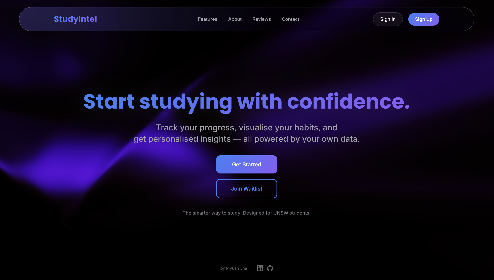
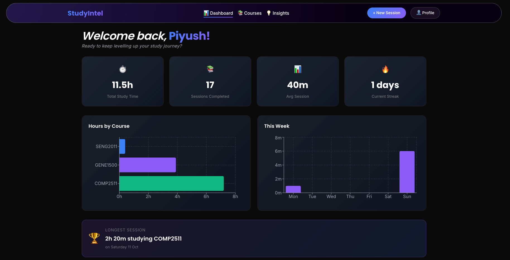
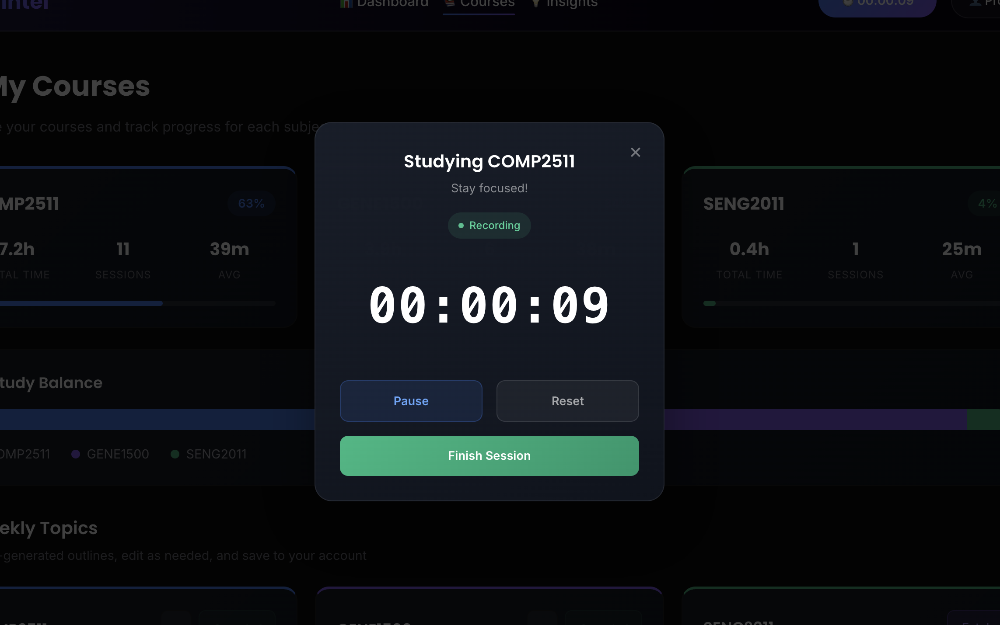
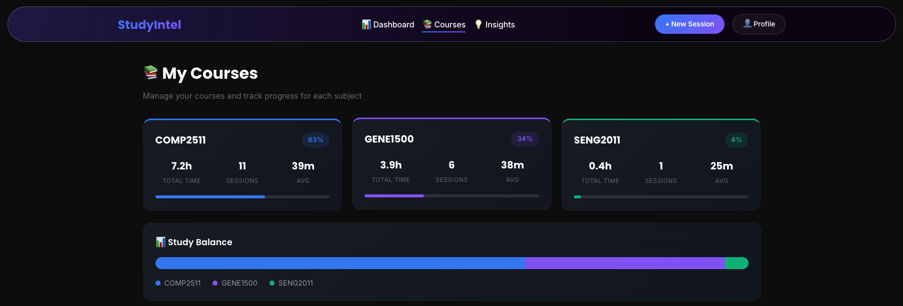
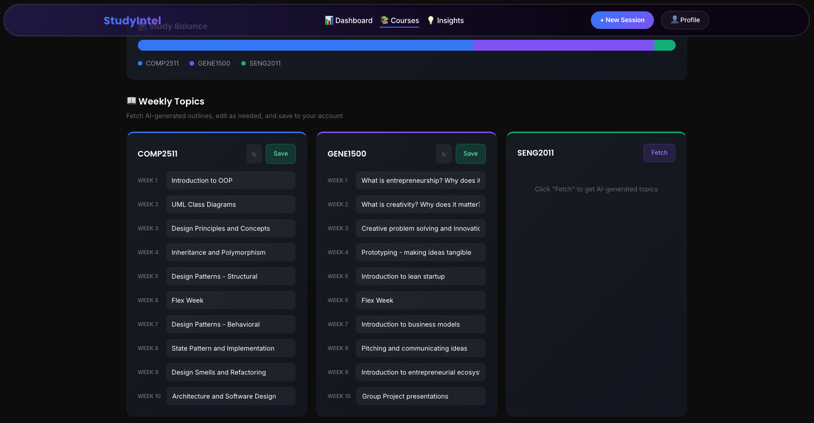
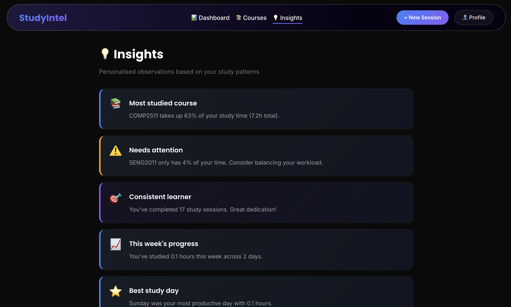
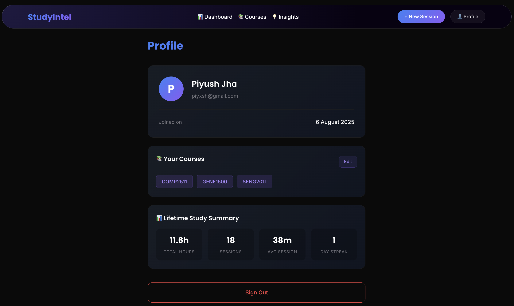

# StudyIntel &mdash; a study analytics platform 

### https://studyintel.app

StudyIntel helps students track study sessions, visualise habits, and receive personalised insights powered by their own data. Designed for UNSW students, the platform combines real-time session tracking with intelligent analytics to help users make the most of their study time.

## The Problem

Students often lack visibility into their study habits. They may feel busy but not productive, struggle to balance multiple courses, or fail to contextualise their efforts. Traditional time-tracking tools provide raw data but no actionable insights.

StudyIntel solves this by turning study session data into meaningful analytics: streak tracking, course balance analysis, session recommendations, and AI-powered topic retrieval; all in a clean and intuitive dashboard.

## Screenshots

### Landing Page


### Dashboard


### Stopwatch


### Courses Page



### Insights Page


### Profile Page


## Features

### Study Session Tracking
Real-time stopwatch with start, pause, resume, and finish controls. Sessions are tied to specific courses and automatically calculate duration. All data persists to PostgreSQL for historical analysis.

### Analytics Dashboard
Interactive visualisations built with Recharts:
- Study time breakdown by course (horizontal bar chart)
- Weekly activity heatmap (last 7 days)
- Key metrics: total hours, session count, average session length, current streak
- Longest session highlight with date and course

### Insights Engine
Personalised recommendations generated from user data:
- Streak celebrations (3+ and 7+ day milestones)
- Course balance warnings (flags under-studied subjects)
- Session length optimisation tips
- Weekly consistency analysis

### Course Management
- Per-course statistics: study time, session count, percentage of total
- Visual study balance bar showing time distribution
- Color-coded progress indicators

### AI-Powered Topic Retrieval
Integration with Perplexity AI to fetch week-by-week lecture topics for UNSW courses. Users can:
- Fetch weekly outlines
- Edit topics inline
- Save personalised versions to their profile

### Authentication & Security
- JWT-based authentication with secure `httpOnly` cookies
- Redis-powered rate limiting (5 failed attempts → 15-minute lockout)

### Waitlist & Legal Pages
- Pre-launch email collection with success confirmation
- Privacy Policy and Terms of Service pages

## Tech Stack

| Layer | Technologies |
|-------|-------------|
| **Frontend** | Next.js 16, TypeScript, Tailwind CSS, Recharts, Framer Motion |
| **Backend** | Node.js, Express, TypeScript |
| **Database** | PostgreSQL (managed), Prisma ORM |
| **Caching** | Upstash Redis (rate limiting) |
| **AI** | Perplexity AI API |
| **Auth** | JWT, bcrypt, secure cookies |
| **Testing** | Jest, Supertest, jest-mock-extended |
| **DevOps** | Docker, Docker Compose, Railway |


## Architecture

```
┌─────────────────┐     ┌─────────────────┐     ┌─────────────────┐
│                 │     │                 │     │                 │
│   Next.js App   │────▶│  Express API    │────▶│   PostgreSQL    │
│   (Frontend)    │     │  (Backend)      │     │   (Database)    │
│                 │     │                 │     │                 │
└─────────────────┘     └───┬───────────┬─┘     └─────────────────┘
                            │           │
                            ▼           ▼
                  ┌─────────────────┐  ┌─────────────────┐
                  │  Upstash Redis  │  │      Resend     │
                  │  (Rate Limiting)│  │     (Emails)    │
                  └─────────────────┘  └─────────────────┘ 
```
### Frontend
- **Next.js App Router** with server and client components
- API route (`/api/me`) proxies authenticated requests to backend
- Tailwind CSS with custom dark theme variables
- Recharts for interactive data visualisation

### Backend
- **Express + TypeScript** REST API 
- **Prisma ORM** for simplified database operations
- Dockerised for consistent deployment
- Stateless design with JWT authentication

### Database
- **PostgreSQL** with relational schema
- Managed hosting on Railway

### Environment Variables

```bash
# Backend
DATABASE_URL=postgresql://...
JWT_SECRET=your-secret-key
UPSTASH_REDIS_REST_URL=https://...
UPSTASH_REDIS_REST_TOKEN=...
PPLX_API_URL=https://api.perplexity.ai/chat/completions
PPLX_API_KEY=...

# Frontend
NEXT_PUBLIC_API_URL=http://localhost:4000
JWT_SECRET=your-secret-key
```

## Docker & Containerisation

The backend is containerised for reproducible builds across different environments.

### Dockerfile (Backend)

```dockerfile
FROM node:20-alpine
WORKDIR /app
COPY package*.json ./
RUN npm ci --only=production
COPY . .
RUN npx prisma generate
RUN npm run build
EXPOSE 4000
CMD ["node", "dist/src/index.js"]
```


## Deployment

### Local Development

1. **Clone the repository**
   ```bash
   git clone https://github.com/PiyushJ1/StudyIntel.git
   ```

2. **Start the backend**
   ```bash
   cd backend
   npm install
   npx prisma migrate dev # run db migration
   npx prisma generate # generate prisma client

   npm run dev
   ```

3. **Start the frontend**
   ```bash
   cd frontend
   npm install
   npm run dev
   ```

4. **Access the app**
   - Frontend: `http://localhost:3000`
   - Backend API: `http://localhost:4000`

### Production

1. **Backend (deployed on Railway)**
   - Create a new Railway project
   - Connect your GitHub repository (backend directory)
   - Add a PostgreSQL plugin (managed database)
   - Set environment variables in Railway dashboard
   - Railway auto-deploys on push to `main`

2. **Frontend (Deployed on Vercel)**
   - Deploy to Vercel
   - Set `NEXT_PUBLIC_API_URL` to your Railway backend URL
   - Configure custom domain if needed

3. **Database**
   - Railway PostgreSQL provides a managed `DATABASE_URL`
   - Run `npx prisma migrate deploy` in production

## Testing

### Test Stack
- **Jest** as the test runner
- **Supertest** for HTTP endpoint testing
- **jest-mock-extended** for type-safe mocking

### Running Tests

```bash
cd backend
npm test              # Run all tests
npm run test:watch    # Watch mode
npm run test:coverage # Generate coverage report
```

### Test Structure

```
src/__tests__/
├── routes/           # API endpoint tests
│   ├── signin.test.ts
│   ├── signup.test.ts
│   ├── startSession.test.ts
│   └── ...
├── utils/            # Utility function tests
├── mocks/            # Reusable mock data
│   └── prisma.mock.ts
└── setup.ts          # Global test configuration
```

## License

MIT License. See [LICENSE.md](./LICENSE.md) for details.
